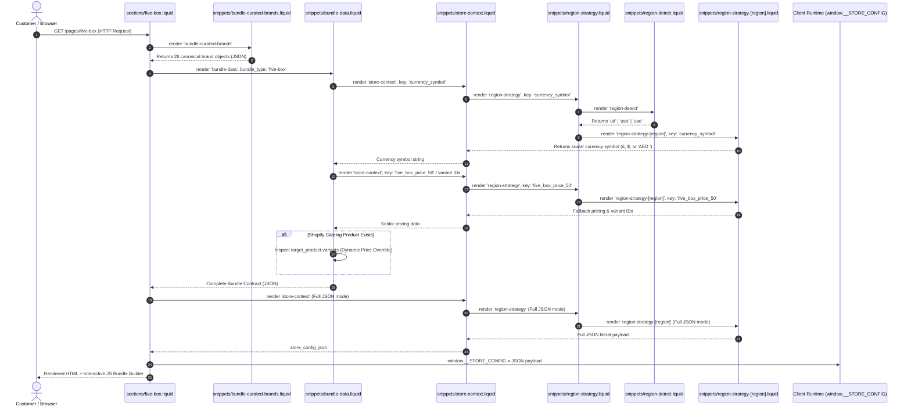
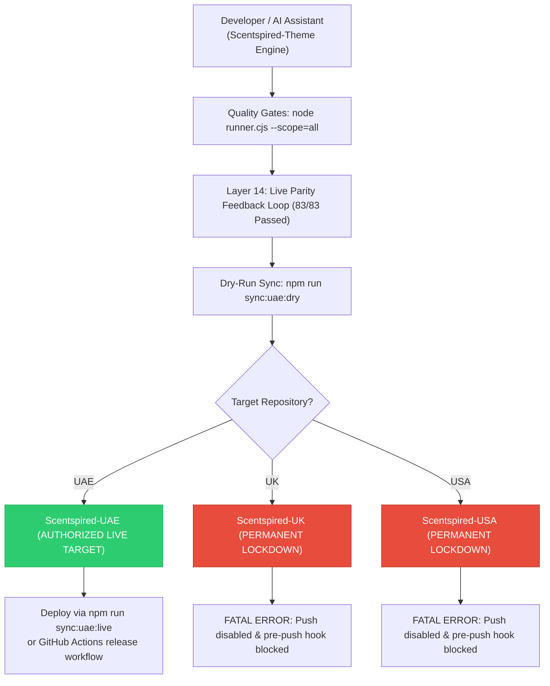

# Scentspired Global Theme Engine — Architecture & Design System

This document outlines the software architecture, design patterns, and deployment lifecycle governing the **Scentspired Theme Engine** across all global storefronts (**UK**, **USA**, and **UAE**).

---

## 1. Comprehensive System Architecture Diagram

```mermaid
graph TD
    %% Presentation Tier
    subgraph Presentation_Tier ["1. Presentation Tier (Liquid & SSR)"]
        THEME["layout/theme.liquid<br/>(Global HTML, Head, SEO, Meta)"]
        CART["snippets/cart-drawer.liquid<br/>(Dynamic Tier Calculations, Shipping)"]
        VIDEO["sections/Video-banner1.liquid<br/>(Hero Video, Category Labels)"]
        FOOTER["sections/footer.liquid<br/>(Trustpilot Flags, Legal, Brand)"]
        FIVEBOX["sections/five-box.liquid<br/>(Five Favourites Bundle Builder)"]
        BUNDLE["sections/bundle.liquid<br/>(Global 5-Box Page Builder)"]
        TRIO["sections/trio-set.liquid<br/>(Signature Trio Bundle Builder)"]
        DISC["sections/discovery.liquid<br/>(Discovery Set Builder)"]
    end

    %% Canonical Catalog Provider
    subgraph Catalog_Tier ["2. Canonical Catalog Tier"]
        BRANDS["snippets/bundle-curated-brands.liquid<br/>(Single Source of Truth: 26 Curated Brands)"]
    end

    %% Central Facade & Data Providers
    subgraph Facade_Tier ["3. Central Facade & Data Provider Tier"]
        CTX["snippets/store-context.liquid<br/>(Central Facade & Feature Registry)"]
        BDATA["snippets/bundle-data.liquid<br/>(100% Region-Agnostic Bundle Catalog Provider)"]
    end

    %% Strategy Resolver & Environment Detection
    subgraph Strategy_Resolver ["4. Strategy Resolver Tier"]
        RESOLVER["snippets/region-strategy.liquid<br/>(Dynamic Strategy Dispatcher)"]
        DETECT["snippets/region-detect.liquid<br/>(Domain & Currency Environment Detection)"]
    end

    %% Concrete Regional Strategies
    subgraph Strategy_Modules ["5. Regional Strategy Profiles (Isolated Single Source)"]
        STRAT_UK["snippets/region-strategy-uk.liquid<br/>(GBP, £, £35 Free Ship, £3.95 Ship, UK Pricing)"]
        STRAT_USA["snippets/region-strategy-usa.liquid<br/>(USD, $, $70 Free Ship, $7.99 Ship, USA Pricing)"]
        STRAT_UAE["snippets/region-strategy-uae.liquid<br/>(AED, 'AED ', 150 AED Free Ship, 25 AED Ship, UAE Pricing)"]
    end

    %% Regional Packages
    subgraph Regional_Packages ["6. Regional Packages Tier (SSOT regions/)"]
        PKG_UK["regions/uk/<br/>(Templates, Locales, Snippets)"]
        PKG_USA["regions/usa/<br/>(Templates, Locales, Snippets)"]
        PKG_UAE["regions/uae/<br/>(Templates, Locales, Snippets)"]
    end

    %% Sync & Deployment Engine
    subgraph Deployment_Engine ["7. Synchronization & Deployment Engine"]
        SYNC["engine/sync-regions.cjs<br/>(SSOT Projection & Prune Engine)"]
        GHA[".github/workflows/auto-update-uae-live.yml<br/>(Automated Release CI/CD Pipeline)"]
        LOCK["lockdown-status.sh<br/>(21/21 Pre-Push & Safety Guard)"]
    end

    %% Target Storefront Repositories
    subgraph Downstream_Targets ["8. Global Downstream Targets"]
        TARGET_UAE["Scentspired-UAE<br/>(ACTIVE DEPLOYMENT TARGET: scentspired.ae)"]
        TARGET_UK["Scentspired-UK<br/>(PERMANENT READ-ONLY LOCKDOWN: scentspired.co.uk)"]
        TARGET_USA["Scentspired-USA<br/>(PERMANENT READ-ONLY LOCKDOWN: scentspired.com)"]
    end

    %% Client-Side JavaScript Runtime
    subgraph Client_Runtime ["9. Client-Side Runtime & State"]
        WINDOW_CONF["window.__STORE_CONFIG<br/>(JSON Serialized Metadata & Thresholds)"]
        WINDOW_SCENT["window.Scentspired.store<br/>(Global JS Store State)"]
        JS_BUNDLE["assets/section-bundle-builder.css & JS<br/>(Client Bundle Selectors & Cart Dispatch)"]
    end

    %% Presentation Connections
    THEME -->|queries seo_title, seo_description| CTX
    THEME -->|exports JSON payload| WINDOW_CONF
    CART -->|queries shipping thresholds & currency| CTX
    VIDEO -->|queries default_video_url, category labels| CTX
    FOOTER -->|queries has_trustpilot feature flag| CTX

    FIVEBOX -->|queries curated brands| BRANDS
    BUNDLE -->|queries curated brands| BRANDS
    TRIO -->|queries curated brands| BRANDS
    DISC -->|queries curated brands| BRANDS

    FIVEBOX -->|queries bundle pricing contract| BDATA
    BUNDLE -->|queries bundle pricing contract| BDATA
    TRIO -->|queries bundle pricing contract| BDATA
    DISC -->|queries bundle pricing contract| BDATA

    %% Facade & Data Connections
    BDATA -->|queries fallback pricing defaults & currency| CTX
    CTX -->|delegates execution| RESOLVER
    RESOLVER -->|evaluates active environment| DETECT
    RESOLVER -->|delegates when uk| STRAT_UK
    RESOLVER -->|delegates when usa| STRAT_USA
    RESOLVER -->|delegates when uae| STRAT_UAE

    %% Regional Packages to Strategies
    PKG_UK -.->|mirrors| STRAT_UK
    PKG_USA -.->|mirrors| STRAT_USA
    PKG_UAE -.->|mirrors| STRAT_UAE

    %% Client JS Integration
    WINDOW_CONF --> WINDOW_SCENT
    WINDOW_CONF --> JS_BUNDLE

    %% Deployment Pipeline Connections
    SYNC -->|projects core + uae package| TARGET_UAE
    GHA -->|triggers on release tag| SYNC
    LOCK -->|blocks manual push to UK| TARGET_UK
    LOCK -->|blocks manual push to USA| TARGET_USA
    LOCK -->|validates theme engine authority| TARGET_UAE
```



---

## 2. Liquid SSR Execution Flow (Runtime Sequence)

The sequence below illustrates how a visitor request to a bundle builder page (e.g., `/pages/five-favourites`) executes with **zero geographic coupling** in the presentation layer:



---

## 3. Core Software Design Patterns Applied

| Design Pattern | Implementation File(s) | Architectural Benefit |
| :--- | :--- | :--- |
| **Strategy Pattern** | `snippets/region-strategy-uk.liquid`<br/>`snippets/region-strategy-usa.liquid`<br/>`snippets/region-strategy-uae.liquid` | Encapsulates all region-specific logic, URLs, currency codes, shipping policies, and fallback price/variant points into swappable, cohesive modules. |
| **Facade & Registry Pattern** | `snippets/store-context.liquid` | Acts as the unified public interface for all presentation sections. Consumers query a single entry point without needing knowledge of underlying regional modules. |
| **Strategy Dispatcher (Factory)** | `snippets/region-strategy.liquid`<br/>`snippets/region-detect.liquid` | Encapsulates polymorphic dispatch. Resolves the runtime store environment based on domain and currency. |
| **Single Source of Truth (SSOT)** | `snippets/bundle-curated-brands.liquid` | Eliminates duplicated brand arrays across four bundle templates. Changing brand tags or ordering is done in exactly one file. |
| **Inversion of Control (IoC)** | `sections/footer.liquid` (via `has_trustpilot`) | Presentation components query declarative feature flags rather than branching on geographic country codes (`if current_region == 'usa'`). |
| **Zero-Coupling Provider** | `snippets/bundle-data.liquid` | Contains **0 instances of `current_region`** and **0 procedural switch cases**. Operates 100% region-agnostically. |

---

## 4. How to Add a New Region (e.g. Canada or Saudi Arabia)

The architecture adheres strictly to the **Open/Closed Principle (OCP)**: *open for extension, closed for modification*.

To introduce a new region (e.g. `ca` for Canada or `sa` for Saudi Arabia):
1. **Create Strategy Module**:
   Create `snippets/region-strategy-ca.liquid` defining all standard scalar keys (`currency_code: CAD`, `currency_symbol: CA$`, `shipping_threshold_cents: 8500`, etc.) and bundle fallbacks.
2. **Register in Strategy Dispatcher**:
   Add a single dispatch branch in `snippets/region-strategy.liquid`:
   ```liquid
   when 'ca'
     render 'region-strategy-ca', key: key
   ```
3. **Register Domain/Currency in Region Detect**:
   Add the detection condition in `snippets/region-detect.liquid`:
   ```liquid
   elsif cart.currency.iso_code == 'CAD' or shop.currency == 'CAD' or shop.domain contains '.ca'
     echo 'ca'
   ```
4. **Zero Presentation Changes Required**:
   - `sections/five-box.liquid`, `bundle.liquid`, `trio-set.liquid`, `discovery.liquid` require **0 edits**.
   - `layout/theme.liquid`, `snippets/cart-drawer.liquid`, `sections/Video-banner1.liquid` require **0 edits**.
   - `snippets/bundle-data.liquid` requires **0 edits**.

---

## 5. Regional Deployment & Safety Policies



### 🔒 Regional Rules
- **UK & USA Live Stores**: Permanent read-only lockdown. No manual git pushes or automated deployments are permitted. All sync scripts enforce hard exit code `1`.
- **UAE Live Store**: Sole authorized live target. Receives core theme engine code + localized `regions/uae` packages automatically.
- **Verification Guarantee**: Every release must pass `npm run test:parity` (83 assertions) and all 14 layers of `runner.cjs` before synchronization.
